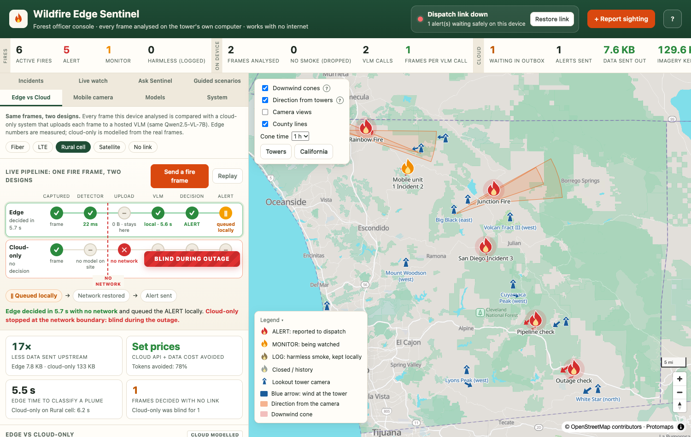

## Problem

Wildfire lookout cameras sit on remote towers where connectivity is weak or absent. Streaming video to a cloud model is often impossible (no link), costly (per-MB and per-token pricing at 24/7 frame rates) and slow, yet early smoke is where minutes matter. Naive detectors also flood dispatch with false alarms from campfires, chimneys, industrial stacks, fog and low cloud.

## Approach

A cascade runs on the tower's edge box, so the expensive model only sees what the cheap one can't settle:

1. **Detect every frame.** A fine-tuned YOLO11 detector checks each frame in about 40 ms.
2. **Gate on persistence.** Only smoke seen at confidence ≥ 0.4 for 3 or more frames becomes a candidate event.
3. **Classify the source once per event.** Qwen2.5-VL-7B with a LoRA adapter, distilled from a 32B teacher, labels the cropped region as wildfire, campfire, controlled burn, industrial stack or fog/cloud, returning schema-constrained JSON.
4. **Re-check the trend** 30 seconds later (growing, static or dissipating), then deterministic rules set the severity: IGNORE, LOG, MONITOR or ALERT.
5. **Send only alerts.** An ALERT becomes a report of about 8 KB, never video. With no link it waits in a durable SQLite outbox and goes out, with retries, the moment the link returns.

**Key decisions**

- **A cascade instead of a VLM on every frame.** Measured on the same 266-frame, 6-tower recording, a cloud-only design makes 266 VLM calls and uploads 23 MB of video; the cascade makes 11 calls and uploads nothing.
- **Code decides severity, not the model.** Rules set the severity and template the report; the VLM writes one sentence. If the VLM times out or returns bad JSON, the pipeline falls back to detector plus trend rules at a minimum severity of MONITOR, so a detection is never silently dropped.
- **Joint replay training instead of tower-only fine-tuning.** Fine-tuning the detector on tower smoke alone reached 0.728 mAP50 on towers but fell to 0.106 on D-Fire (catastrophic forgetting). Training on both datasets together kept D-Fire at 0.748 and towers at 0.718.
- **Kept YOLO11s over YOLO11m.** The larger model reached 0.658 combined-validation mAP50 after 10 epochs, against 0.730 for the deployed YOLO11s joint model, so it wasn't adopted.
- **Cloud only for what the tower can't produce.** Forecasts and burn schedules are fetched only for ALERT events, after the alert itself has been sent.

## Results

All measured on the Nano:

| Measure | Before | After |
|---|---|---|
| Detector mAP50, D-Fire test | 0.002 (YOLO-World zero-shot) | 0.748 |
| Detector mAP50, lookout-tower smoke | 0.198 | 0.718 |
| VLM source-type agreement with the 32B teacher (500 held-out crops) | 45.0% | 73.6% |
| End-to-end recall, 25 real tower clips (15 with fire) | 0/15 | 11/15 |

| Same 266-frame, 6-tower recording | Cloud-only | Edge (this system) |
|---|---|---|
| VLM calls | 266 | 11 |
| Tokens | 447K | 3K |
| Video uploaded | 23 MB | 0 B |
| Time to decision (rural cell link) | 6.3 s | 5.4 s |
| During a network outage | blind | decides and queues the alert |

The fine-tuned models are published on Hugging Face: the [detector](https://huggingface.co/SavithaVijayarangan/wildfire-edge-sentinel-detector) and the [context LoRA](https://huggingface.co/SavithaVijayarangan/wildfire-edge-sentinel-context-lora).

## What I'd do next

- **Measure real accuracy, not teacher agreement.** The LoRA student is scored against the 32B teacher's labels. A larger hand-checked gold split would measure true accuracy and remove the near-duplicate-frame risk in the held-out crops.
- **Grow the end-to-end set.** 25 clips give coarse precision and recall, and some "no-fire" clips contain unlabelled smoke, so false-alarm numbers are still provisional.
- **Stop VLM calls from stalling other towers.** One replay thread serves every tower, so a VLM call pauses frame processing for all of them until it returns.
- **Replace the simulated parts.** Towers are replayed clips, and the temperature sensor, connectivity toggle and dispatch webhook are simulated.
